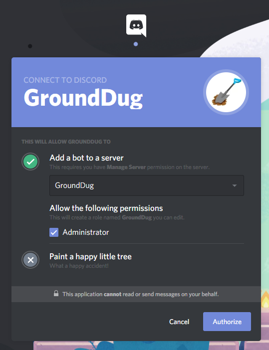

# Getting started with GroundDug

## Adding GroundDug to your server

To use GroundDug, you will first need to add it to your server by inviting and authorizing it.

### Inviting GroundDug


You must be logged onto Discord when trying to invite it. If you do not do this, the server you are trying to add GroundDug to may not show up at all.


Firstly, click [this link](https://discordapp.com/oauth2/authorize?client_id=553602353962549249&scope=bot&permissions=8) to get an invite for GroundDug. Select the server you are wanting to add GroundDug to and press "Authorize"

### Move the bot role higher in the hierarchy

In order for the bot to have permissions to act on most users, you will need to move it higher in the hierarchy list. Go to your server and open the server settings. Under the role section, click the GroundDug role and move it to the top of the list.


Keep in mind that the role of GroundDug does not have to be the highest role. The roles below GroundDug are users that the bot can act upon with kicking, banning e.c.t.

If you do not want some users to be banned by GroundDug, keep those users above the role of GroundDug \(e.g. Administrators\)


Ensure your changes are saved by pressing the green `Save Settings` button on the bottom.

